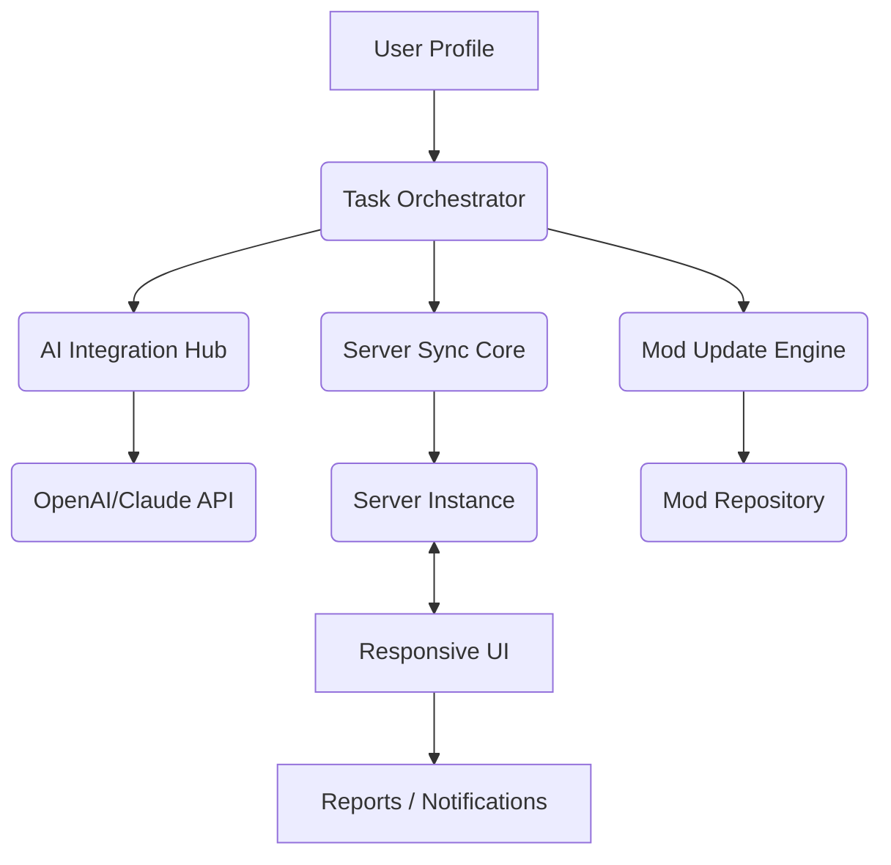

# 🌠 Automate-New-Horizon

Source code for **Automate-New-Horizon** — an innovative open platform for Minecraft modpack automation, scriptable task orchestration, and dynamic server management. Join the Automate-New-Horizon revolution and reshape how Minecraft modded experiences are built, tested, and maintained! 🚀

---

## 💎 Table of Contents

- [Project Vision](#project-vision-🔭)
- [Key Features](#key-features-✨)
- [Getting Started](#getting-started-🚀)
- [Mermaid Diagram](#mermaid-diagram-🔗)
- [Example Profile Configuration](#example-profile-configuration-📝)
- [Example Console Invocation](#example-console-invocation-💻)
- [ OS Compatibility Table](#-os-compatibility-table-🖥️)
- [Integration Capabilities](#integration-capabilities-🤖)
- [Multilingual & Human Touch](#multilingual--human-touch-🌐)
- [SEO-Friendly Utility](#seo-friendly-utility-🔍)
- [License](#license-📜)
- [Disclaimer](#disclaimer-⚠️)

---

## Project Vision 🔭

Welcome to **Automate-New-Horizon**, where tinkering turns into orchestration. We believe there’s more to Minecraft modpacks than just blocks and mobs. Automation transforms tedious steps into symphonies: coordinating mod updates, synchronizing configuration changes, and triggering server events as water flows over stones. Here, Minecraft modpack management is no longer a solo journey; it’s an intelligent ecosystem, powered by your imagination (and a sprinkle of AI).

---

## Key Features ✨

- **Intelligent Modpack Automation**: Define, schedule, and link tasks across files, mods, configs, and servers, enabling dimensional leaps in productivity.
- **AI Workflow Assistant**: Seamless integration with major LLM APIs (OpenAI, Claude) — craft scripts, auto-resolve conflicts, and brainstorm with conversational prompts.
- **Dynamic Responsive UI 👾**: Adaptive to desktop, mobile, and command line — control your pipeline wherever creativity strikes.
- **Multi-Context Scripting**: YAML, TOML, and JSON profile support for custom modpack pipelines; empower mod authors and server admins alike.
- **24/7 Stellar Support**: Our cosmic community and AI-powered helpdesk are at your side, day or night, tame or wild.
- **Multilingual Interface 🌍**: Automatic language detection and translation for a seamless intergalactic collaboration.
- **Continuous Build, Test & Release**: Integrated pipeline with live reporting, instant mod updates, and server auto-refresh; keep players dancing to the rhythm of progress.
- **OS Synergy**: Versatile — whether you're a macOS captain, a Linux explorer, or a Windows pioneer, Automate-New-Horizon welcomes all on board.

---

## Getting Started 🚀

Set up Automate-New-Horizon today and experience new automation frontiers! For the bold and the curious:

1. **Download the latest stable build:**  
   

2. **Unpack to your desired directory**  
3. **Customize your user profile or select a Quick-Launch preset**  
4. **Launch via UI or command line (see below)**  
5. **Configure your pipeline and soar into orbit!**

### Requirements

- Java 17+ (for Minecraft modpack compatibility)
- Python 3.10+ (for scripting extensions)
- Modern browser (for web-UI)

---

## Mermaid Diagram 🔗

Explore the galaxy of possibilities! Here’s how Automate-New-Horizon orchestrates its workflow modules:

---

## Example Profile Configuration 📝

Here’s a sample YAML profile for an automated modpack pipeline:

    profileName: "Skyblock_Stellar"
    language: "en"
    mods:
      - name: "Create"
        version: "0.5.1d"
      - name: "Immersive Engineering"
        version: "1.18.2-8.0.1"
    server:
      address: "my.stellar.server"
      autoRestart: true
    automation:
      schedule: "0 5 * * *"  # Every day at 05:00 server time
      onModUpdate:
        - notify: "Discord"
        - backup: "full"
        - run: "validate_integrity"
    aiAssistance:
      enabled: true
      provider: "OpenAI"
      language: "English"

---

## Example Console Invocation 💻

Feeling heroic? Launch directly from the console:

    java -jar automate-new-horizon.jar --profile Skyblock_Stellar.yml --mode pipeline --ai-assist

Or, to invoke a targeted pipeline:

    automate-nh run --config configs/stellar.toml --trigger modUpdate --openai

---

## 🖥️ OS Compatibility Table

|    System    | Supported? | Native UI | Command Line | Notes                  |
|:------------:|:----------:|:---------:|:------------:|:----------------------:|
| 🪟 Windows   |    ✔️      |    ✔️     |      ✔️      | Full feature parity    |
| 🐧 Linux     |    ✔️      |    ✔️     |      ✔️      | Optimized integrations |
| 🍎 macOS     |    ✔️      |    ✔️     |      ✔️      | M1 native build avail. |
| 📱 Android   |    ⏳      |    🚧     |      ✔️      | CLI only, beta phase   |

---

## Integration Capabilities 🤖

### OpenAI API

- Use GPT models for pipeline recommendations, troubleshooting, or witty banter.
- Example prompt: “Suggest a server mod configuration for 100+ players with minimal lag.”
- Auto-inline suggestions in modpack config files.

### Claude API

- Leverage powerful contextual understanding for automation and documentation.
- Auto-generate changelogs, event scripts, and error resolutions in real-time.

**NOTE:** Both API integrations require setting your unique API key in the `config/ai.yml` file.

---

## Multilingual & Human Touch 🌐

- **Auto-detect system language** — switch UI language on first launch.
- **Manual language override** via `--lang` flag or UI preferences.
- Languages available: English, Spanish, Portuguese, Russian, French, Japanese, Mandarin, and more on the cosmic roadmap.

---

## SEO-Friendly Utility 🔍

Automate-New-Horizon is crafted for Minecraft modpack creators, server operators, and automation devotees seeking advanced task orchestration, streamlined mod management, and creative AI conversation. Unlock the ultimate synergy of scripting, server operations, and automated solutions — all within a single responsive toolkit. 

**Keyword highlights**: Minecraft modpack automation, server orchestration, AI-powered configuration, cross-platform toolkit, modded Minecraft management, automation for gamers, scriptable modpack pipelines, OpenAI integration, Claude LLM support, 24/7 technical support, responsive UI, multilingual modding utility.

---

## License 📜

This project is licensed under the [MIT License](https://opensource.org/licenses/MIT).  
© Automate-New-Horizon Contributory Team 2026.

---

## Disclaimer ⚠️

Automate-New-Horizon is a community-driven tool for modpack automation and Minecraft server management. Not created or endorsed by Mojang/Microsoft. API-based AI features require external keys and may incur third-party costs. Use responsibly — always keep backups of critical modpacks and server data. All content herein is crafted for experimentation and creative synergy, not for exploits or circumvention of official mod or server rules.

---

Let the Automate-New-Horizon adventure begin! 🌌